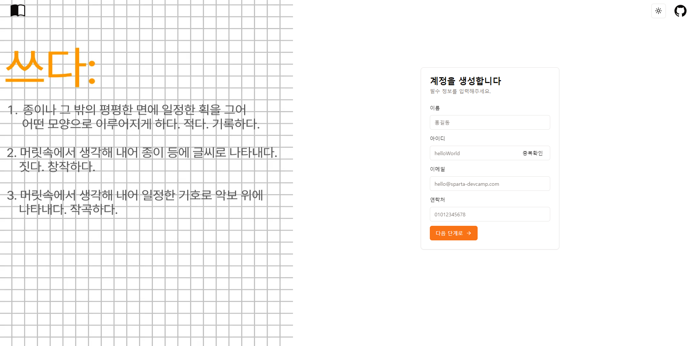
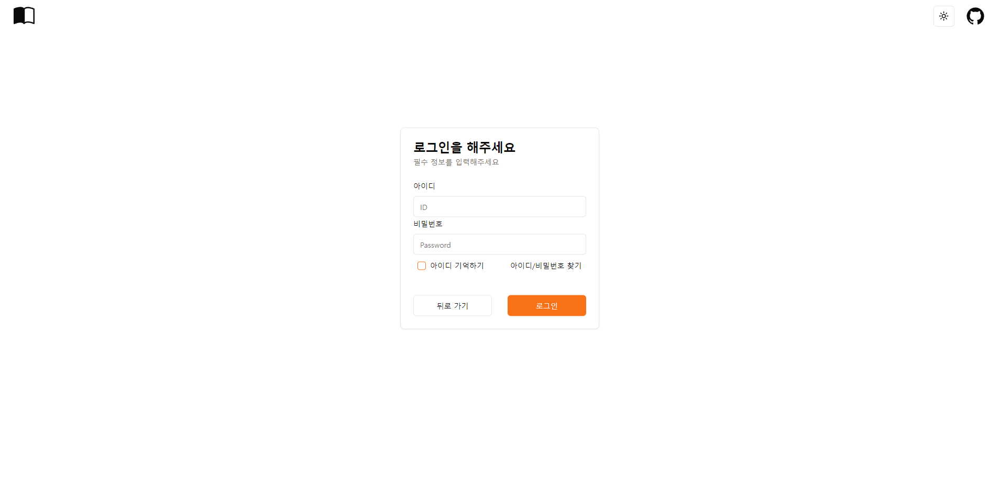

### 메인화면

![![alt text]](public/2024-03-08_00_03_56.gif)
 
타자기 애니메이션 라이브러리 Typewriter를 이용하여 메인 사이트를 꾸몄습니다.
버튼 sign-up은 회원가입 페이지로, log-in은 로그인 페이지로 이동 가능합니다.

#### 헤더

홈으로 이동할 수 있는 로고,
다크모드, 오렌지 색, 기본 색으로 변화할 수 있는 버튼과
깃허브로 이동 가능한 헤더로 구성했습니다.
페이지를 이동해도 유지됩니다.

### 회원가입 페이지

#### 회원가입 기능

스키마 선언 및 유효성 검사 라이브러리 zod를 이용하여 실시간 유효성 검사와
회원가입을 위한 개인정보를 단계별로 진행합니다.
마지막 페이지의 계정 등록을 하면 form으로 정보를 띄웁니다.

#### 추가할 기능

1. mockapi를 통해 아이디 중복확인을 구현할 예정입니다.
2. 현재 달력으로 생일을 입력하지만, select로 개별 년/월/일을 고를 수 있도록 수정할 예정입니다.
3. 회원가입 시 자동 로그인이 가능하도록 구현 시도할 예정입니다.

### 로그인 페이지

#### 로그인 기능

아이디와 비밀번호로 로그인이 가능합니다.
zod로 실시간 유효성 검사가 가능합니다.

#### 추가할 기능

1. 쿠키를 통해 아이디 기억하기 기능을 구현할 예정입니다.
2. 로그인이 안되는 경우, confirm 메세지를 통해 회원가입 페이지로 이동할 예정입니다.
3. 비번을 모르는 경우 이메일 보내는 기능을 구현해볼 예정입니다.
